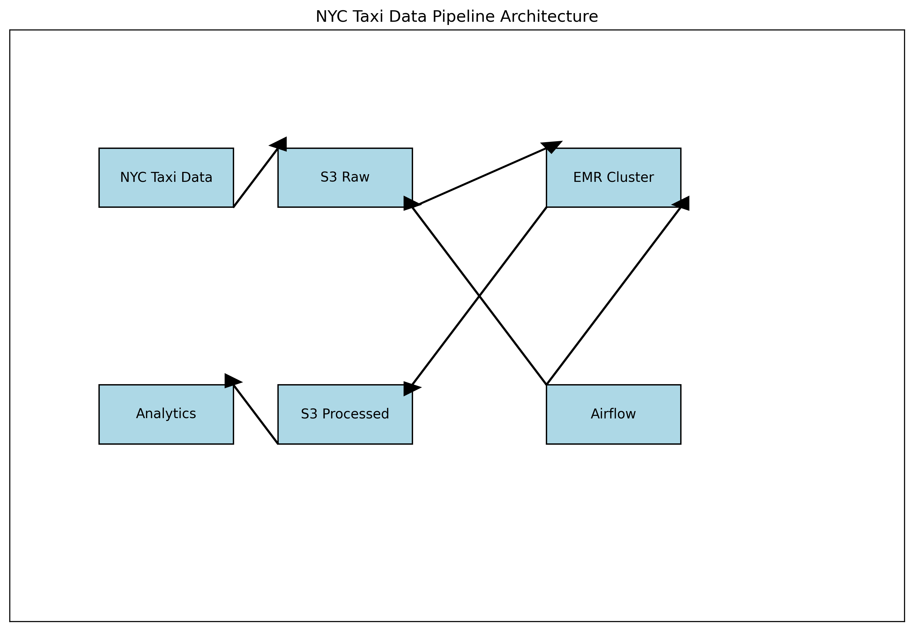

# NYC Taxi Data Pipeline

A cloud-scale data pipeline for processing the New York City Taxi Trip dataset using AWS services, Apache Spark, Airflow, and Docker.

## Project Overview

This project implements a scalable data pipeline that:
- Ingests NYC Taxi Trip data
- Stores raw data in Amazon S3
- Processes data using Apache Spark on AWS EMR
- Orchestrates workflows with Apache Airflow
- Containerizes components with Docker
- Optimizes for cost efficiency

## Architecture



The pipeline follows these steps:
1. Data is ingested from the NYC Taxi Trip dataset source
2. Raw data is stored in Amazon S3
3. Apache Spark on AWS EMR processes the data
4. Processed data is stored back in S3 in Parquet format
5. Apache Airflow orchestrates the entire workflow
6. Docker containers provide consistent development and deployment environments

## Project Structure

```
spark-aws-data-pipeline/
├── airflow/                  # Airflow DAGs and configurations
│   ├── dags/                 # Workflow definitions
│   └── docker-compose.yaml   # Airflow services configuration
├── docker/                   # Docker configurations
│   ├── airflow/              # Airflow Dockerfile and configs
│   └── spark/                # Spark Dockerfile and configs
├── spark/                    # Spark processing scripts
│   ├── jobs/                 # PySpark processing jobs
│   └── utils/                # Utility functions
├── aws/                      # AWS setup scripts
│   ├── emr/                  # EMR cluster configurations
│   └── s3/                   # S3 bucket setup
├── data/                     # Sample data and schemas
├── docs/                     # Documentation
├── tests/                    # Unit and integration tests
├── .env.example              # Example environment variables
├── docker-compose.yaml       # Main Docker Compose configuration
└── README.md                 # Project documentation
```

## Prerequisites

- AWS Account
- Docker and Docker Compose
- Python 3.8+
- AWS CLI configured

## Setup Instructions

### 1. Clone the repository

```bash
git clone https://github.com/yourusername/spark-aws-data-pipeline.git
cd spark-aws-data-pipeline
```

### 2. Set up environment variables

```bash
cp .env.example .env
# Edit .env with your AWS credentials and configuration
```

### 3. Set up AWS resources

```bash
# Create S3 buckets for raw and processed data
python aws/s3/create_buckets.py

# Configure EMR cluster template
python aws/emr/configure_cluster.py
```

### 4. Start the local development environment

```bash
docker-compose up -d
```

### 5. Access Airflow UI

Open your browser and navigate to `http://localhost:8080`

## Running the Pipeline

The pipeline can be triggered through the Airflow UI or via the command line:

```bash
# Trigger the pipeline manually
docker-compose exec airflow airflow dags trigger nyc_taxi_pipeline
```

## Cost Optimization

This project implements several cost optimization strategies:
- Utilizing AWS Free Tier where possible
- EMR cluster auto-scaling and termination policies
- Spot Instances for EMR worker nodes
- Efficient data storage with Parquet format
- Scheduled processing to minimize resource usage

## Contributing

Contributions are welcome! Please feel free to submit a Pull Request.

## License

This project is licensed under the MIT License - see the LICENSE file for details. 